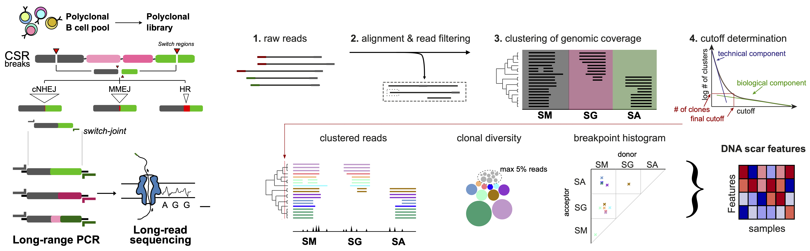

swibrid
#######

SWIBRID (SWItch joint Breakpoint Repertoire IDentification) is a computational pipeline to analyze long-read sequencing data of switch joints occurring during class switch recombination.

documentation
=============

read the `documentation <https://bihealth.github.io/swibrid/>`_.

quick start guide
=================

installation
------------

#. clone the github repo and change into the source folder::

        git clone git@github.com:bihealth/swibrid.git
        cd swibrid

#. create a conda environment::

        conda env create -f swibrid_env.yaml
        conda activate swibrid_env

#. install ``swibrid``::

        pip install .

testing
-------

for a simple and (relatively) quick end-to-end test, run::

   swibrid test

this will create two samples with about 1000 synthetic reads in ``input`` and run the pipeline on this data,
using a reduced hg38 genome in ``index`` with only the switch region (chr14:105000000-106000000).
it will probably take about 5 minutes and produce plots in ``output/read_plots`` and 
table of summary statistics in ``output/summary``

running your own data
---------------------

this assumes you have a ``fastq.gz`` file with sequencing output from minION or PacBio.
If samples were multiplexed (e.g., with ONT barcodes), you should set up a sample sheet like so::

   BC01         sample1
   BC02         sample2
   ...

and a file with barcode and primer sequences like so::

   >BC01
   AAGAAAGTTGTCGGTGTCTTTGTG
   >BC02
   TCGATTCCGTTTGTAGTCGTCTGT
   ...
   >primer_mu_fw
   CACCCTTGAAAGTAGCCCATGCCTTCC
   >primer_alpha_rv
   CTCAGTCCAACACCCACCACTCC
   >primer_gamma_rv
   CTGCCTCCCAGTGTCCTGCATTACTTCTG

#. set up snakemake and config files in a new directory::

        mkdir results
        cd results
        swibrid setup

#. provide genome (+ index), annotation files in ``index``::

        mkdir index
        cd index
        # get hg38 genome from UCSC (or elsewhere)
        wget http://hgdownload.soe.ucsc.edu/goldenpath/hg38/bigZips/hg38.fa.gz 
        gunzip hg38.fa.gz
        # create LAST index
        lastdb hg38db hg38.fa 
        # download gene annotation from ENCODE (or elsewhere)
        wget https://ftp.ebi.ac.uk/pub/databases/gencode/Gencode_human/release_33/gencode.v33.annotation.gtf.gz
        gunzip gencode.v33.annotation.gtf.gz
        swibrid get_annotation -i gencode.v33.annotation.gtf -o gencode.v33.annotation.exon.gene_shorted.bed

#. create bed file with switch region definitions::

	chr14	105588700	105591700	SA2
	chr14	105603000	105603500	SE
	chr14	105626500	105629000	SG4
	chr14	105645400	105647900	SG2
	chr14	105708900	105712900	SA1
	chr14	105743700	105747700	SG1
	chr14	105772100	105775600	SG3
	chr14	105856100	105861100	SM

#. edit (at least) the following entries in the ``config.yaml`` file (make sure that sample names in ``SAMPLES`` all appear in the sample sheet)::
   
        INPUT: "path/to/input.fastq.gz"
        SAMPLE_SHEET: "path/to/sample_sheet.csv"
        BARCODES_PRIMERS: "path/to/barcodes_primers.fa" 
        SAMPLES: ["sample1","sample2", ...]
        SWITCH_ANNOTATION: "path/to/switch_regions.bed"
    
   
#. run the pipeline::

        swibrid run -np        # for a dry-run
        swibrid run            # for an actual run
        swibrid run --slurm    # submit to slurm
        swibrid run --unlock   # unlock snakemake before restarting an interrupted/killed instance
