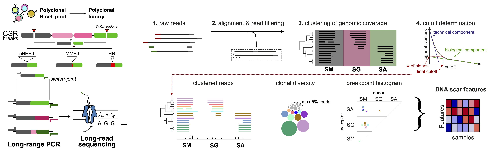

.. swibrid documentation master file, created by
   sphinx-quickstart on Wed Nov  6 15:20:40 2024.
   You can adapt this file completely to your liking, but it should at least
   contain the root `toctree` directive.

swibrid documentation
=====================

SWIBRID (SWItch joint Breakpoint Repertoire IDentification) is a computational pipeline to analyze long-read sequencing data of switch joints occurring during class switch recombination.

.. toctree::
   :maxdepth: 2
   :caption: Contents:

   quickstart.rst
   configure.rst
   output.rst 
   cli.rst

