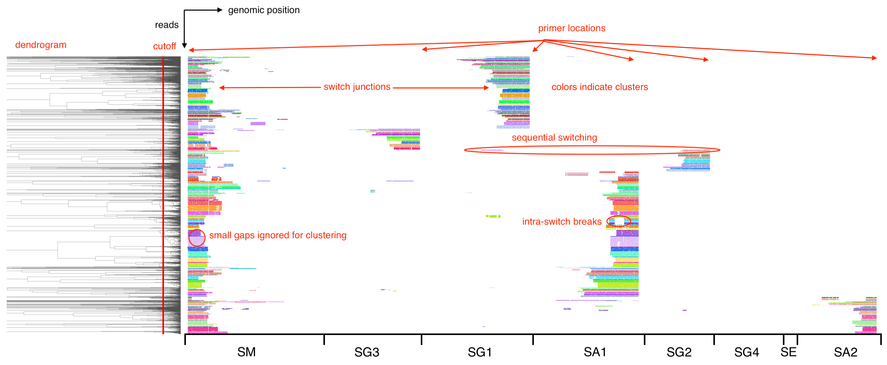
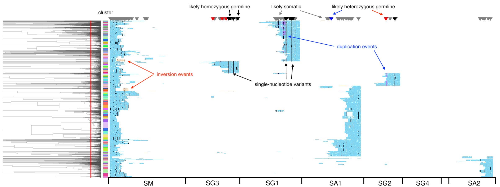
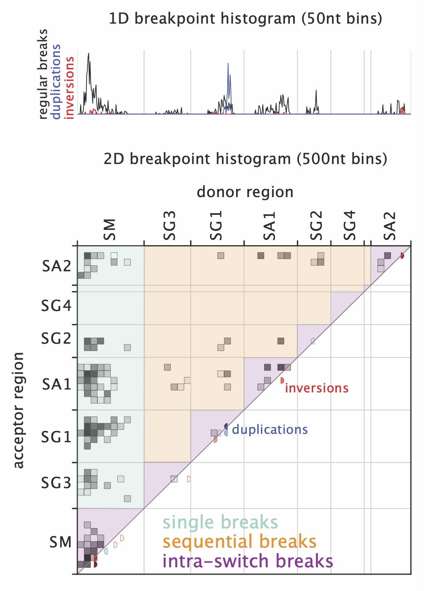
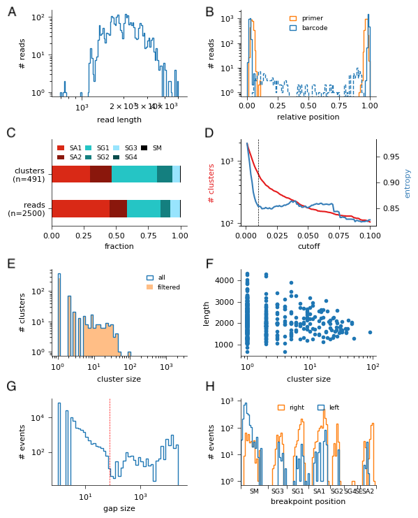
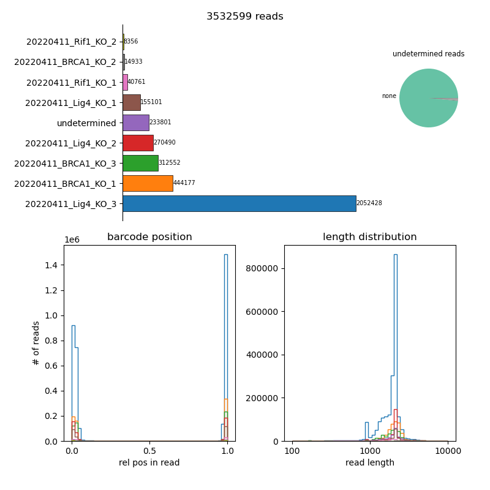

understanding output
====================

read plot
*********

SWIBRID produces read plots to visualize alignments, clustering and single-nucleotide/structural variants detected in input reads. By default, two plots are produced (in ``output/read_plots``). The first one shows all read alignments to selected regions in the IGH locus, where reads are ordered according to the dendrogram produced by hierarchical clustering and colored by the cluster identity obtained from cutting the dendrogram at the specified cutoff (indicated by the red line). Primer locations are visible from the "justified" positions of the read ends, while breaks are visible from the "ragged" positions. Small gaps are ignored for clustering, while intermediate gaps indicate intra-switch breaks, and large gaps regular switch junctions.

The second plot shows the same reads but now colored by coverage (of the genome, per read): blue indicates 1x coverage, violet 2x coverage (i.e., a duplication event), and orange negative coverage (an inversion event). Single-nucleotide variants are marked by black dots, and triangles on top indicate a tentative assignment of these variants into likely homo- or heterozygous germline, or likely somatic.

breakpoint histogram
********************

The breakpoint histograms (in ``output/breakpoint_plots``) show 1D and 2D histograms of breakpoint positions over selected regions in the IGH locus. Regular breaks are shown in black, while breaks connected to inversions and duplications are shown in red and blue, respectively. The 1D histogram shows donor and acceptor breakpoints together in 50nt bins, the 2D histogram shows junctions between a donor region (on the x-axis) and an acceptor region (on the y-axis) in 500nt bins. The regions shaded in green, orange and purple indicate breaks corresponding to "single" events, sequential switching or intra-switch breaks, respectively. Inversions and duplications (in red and blue) are indicated in the lower right diagonal of the plot.

QC plot
*******

QC plots are created in ``output/QC_plots`` and contain the following panels:

A.
        histogram of input read lengths

B. 
        histogram of positions of detected primers and barcodes (dashed lines indicate "internal" barcodes / primers, i.e., more than 100nt from the ends)

C.      
        isotype composition, as fraction of clusters (top) or reads (bottom)

D.
        plot of # clusters (in red; left y-axis, log-scale) as function of dendrogram cutoff, or of the entropy of the cluster distribution (blue; right y-axis, linear scale)

E.
        histogram of cluster size, filtered clusters are indicated by orange shading

F.

        scatter plot of clone length (in nt) vs. cluster size (# of reads). 

G.
        histogram of gap sizes in MSA. 75bp cutoff is indicated by red line

H.
        histogram of breakpoint positions, separated by donor (=left) and acceptor (=right)

output features
***************

SWIBRID produces a table of features for each sample in ``output/summary``. Below is a detailed explanation of the columns in that file. Note that some feature names are different internally and only changed to these values in the final aggregation step (`swibrid collect_results`). Check the source code for the mapping of old to new names.

QC features
-----------

        nreads_initial
                initial number of reads

        nreads_mapped
                number of reads mapped

        nreads_removed_short
                number of reads that are too short for processing (<500nt)

        nreads_removed_incomplete
                number of reads without forward and reverse primer

        nreads_removed_no_info
                number of reads without info on primers

        nreads_removed_internal_primer
                number of reads removed because of internal primers

        nreads_removed_no_switch
                number of reads removed because of lacking alignment to switch region

        nreads_removed_length_mismatch
                number of reads removed because mapped part of read are much longer than mapped part of genome 

        nreads_removed_overlap_mismatch
                number of reads removed because there's overlap betwen alignments on the read or on the genome

        nreads_inversions
                number of reads that contain inverted segments

        nreads_removed_low_cov
                number of reads removed because too little of the read maps

        nreads_removed_switch_order
                number of reads removed because switch alignments are in wrong order

        nreads_removed_no_isotype
                number of reads removed because isotype could not be determined

        nreads_removed_duplicate
                number of reads removed because of duplicate UMIs (in UMI mode, ``--remove-duplicates``)

        nreads_unmapped
                number of unmapped reads
        
        frac_reads_unused
                fraction of unused reads

        nreads
                final number of reads

        mean_frac_mapped
                mean fraction of read that's mapped

        mean_frac_mapped_multi
                mean fraction of read that's mapped multiple 

        mean_frac_ignored
                mean fraction of read that doesn't map to selected switch regions

        clustering_cutoff
                dendrogram cutoff (specified or inferred from data)

        frac_singletons
                fraction of singleton clusters

        PCR_bias_length
                regression coefficient of cluster length vs. cluster size 

        PCR_bias_GC
                regression coefficient of cluster GC vs. cluster size 

diversity features
------------------

        these features are computed twice: once on the total number of reads ("_raw"), and then again as averages of 10 replicates from downsampling to 1000 reads

        clusters_initial
                pre-filter cluster number

        clusters(_raw)
                post-filter cluster number

        clusters_eff(_raw)
                number of equally-sized clusters that has the same entropy as observed

        cluster_size_(mean/std)(_raw)
                mean and std.dev of cluster size (in fraction of reads)

        cluster_gini(_raw)
                Gini cofficient of cluster size distribution

        cluster_entropy(_raw)
                entropy of cluster size distribution

        cluster_inverse_simpson(_raw)
                inverse Simpson coefficient of cluster size distribution

        occupancy_top_cluster(_raw)
                fraction of reads in biggest cluster

        occupancy_big_clusters(_raw)
                fraction of reads in all clusters that contain more than 1% of reads

        read_length_(mean/std)
                mean and std.dev. of length of reads in clusters (in nt)

        GC_content_(mean/std)
                mean and std.dev. GC content of clusters
        
        read_length_(mean/std)_SX
                mean and std of cluster length for isotype SX

isotypes
--------

        frac_reads_SX
                fraction of reads in isotype SX
        
        pct_clusters_SX
                percentage of clusters with isotype SX
        
        alpha_ratio_reads
                fraction of reads with isotype SA* 

        alpha_ratio_clusters
                fraction of clusters with isotype SA*

structural rearrangements
-------------------------

        pct_templated_inserts
                insert frequency (over the dataset)

        inversion_size
                median size of inversions

        duplication_size
                median size of duplications
        
        pct_inversions
                percentage of breaks creating inversions

        pct_duplications
                percentage of breaks creating duplications

        frac_breaks_inversions_intra
                fraction of breaks creating inversions for intra-switch breaks

        frac_breaks_duplications_intra
                fraction of breaks creating duplications for intra-switch breaks

        n_inserts
                number of inserts

        n_unique_inserts
                number of unique inserts

        n_clusters_inserts
                number of clusters with inserts

        mean_cluster_insert_frequency
                mean insert frequency (per cluster)

        mean_insert_overlap
                mean overlap of inserts for reads in the same cluster

        mean_insert_pos_overlap
                mean overlap of left and right insert-generating breakpoints for reads in the same cluster

        mean_insert_length
                mean insert length

        mean_insert_gap_length
                mean length of gaps between left and right insert-generating breakpoints

        ninserts_SX_SY
                number of inserts between SX and SY regions

context features
----------------

        untemplated_inserts
                mean number of untemplated nucleotides for switch junctions

        untemplated_inserts_SX
                mean number of untemplated nucleotides for switch junctions for isotype SX
                
        homology
                mean number of homologous nucleotides for switch junctions

        homology_SX
                mean number of homologous nucleotides for switch junctions of isotype SX

        pct_blunt
                percentage of blunt ends (no untemplated, no homologous nucleotides)

        pct_blunt_SX
                percentage of blunt ends (no untemplated, no homologous nucleotides) for isotype SX
        
        homology_score_fw
                average amount of homology in 50nt bins between donor and acceptor region

        homology_score_rv
                average amount of (reverse-complementary) homology in 50nt bins between donor and acceptor region

        homology_score_fw/rv_SX_SY
                average amount of homology in 50nt bins between donor (SX) and acceptor (SY) region

        donor_score_M
                score (=weighted frequency) for motif M (M=S,W,WGCW,GAGCT,GGGST with S=G/C, W=A/T) in 50nt bins of donor switch regions

        acceptor_score_M
                score for motif M in 50nt bins of acceptor switch regions

        donor_complexity
                complexity score (number of observed 5mers / number of possible 5mers) in 50nt bins of donor switch regions
        
        acceptor_complexity
                complexity score for acceptor regions
        
        donor/acceptor_score_M_SX_SY
                donor/acceptor score for motif M between donor region SX and acceptor region SY

        donor/acceptor_complexity_SX_SY
                donor/acceptor complexity between donor region SX and acceptor region SY

breakpoint matrix
-----------------

        breaks_normalized
                number of breaks by number of clusters
        
        pct_breaks_SX_SY
                fraction of breaks between SX and SY
        
        pct_direct_switch
                percentage of "single" breaks (see green region in 2D breakpoint histogram)
                
        pct_sequential_switch
                percentage of "sequential" breaks (see orange region in 2D breakpoint histogram)

        pct_intraswitch_deletion
                percentage of breaks creating intraswitch deletions (see purple region in 2D breakpoint histogram)

        intraswitch_size_(mean/std)
                mean and std.dev. size of intra-switch breaks

        break_dispersion_SX
                dispersion (standard deviation) of breakpoint positions in region SX
        
variants
--------
        
        num_variants
                number of detected single-nucleotide variants

        somatic_variants
                number of variants classified as likely somatic (not germline)

        frac_variants_transitions
                fraction of transition variants

        frac_variants_X>Y
                fraction of variants from ref X to alt Y
        
        num_variants_M
                number of variants around specific motif (M=Tw, wrCy, Cg)

demultiplexing
**************

``swibrid demultiplex`` creates fastq files for each sample in a sample sheet, together with ``{sample}_info.csv`` files that contain meta-data for each read (taken from the header of the original raw output, plus locations and identities of detected primers and barcodes). It also creates a summary csv file with statistics on how many reads were assigned to each sample barcode, and a summary figure:

The bar plot top left shows how many reads were assigned to each sample or remained "undetermined". The pie chart on the right shows a breakdown of undetermined reads by barcode, in case the sample sheet is missing a sample barcode appearing in the reads. The histogram in the lower left shows relative locations of the detected barcodes, and the one in the lower right the distriubtion of read lengths in each sample (colors match the sample colors in the top plot).

other output
************

the pipeline writes intermediate files to folders ``pipeline/{sample}`` and log files to ``logs/{step}`` (or ``logs/slurm/{step}`` if ``--slurm`` is used). intermediate files are

``{sample}_aligned.par``
        LAST parameters estimated for that sample

``{sample}_last_pars.npz``
        LAST parameters as numpy array

``{sample}_aligned.maf.gz``
        LAST output (as MAF) for that sample

``{sample}_telo.out``
        output from BLASTing reads against telomer repeats

``{sample}_processed.out``
        ``process_alignments`` output table

``{sample}_process_stats.csv``
        ``process_alignments`` stats

``{sample}_aligned.fasta.gz``
        aligned reads as input to ``construct_MSA``

``{sample}_breakpoint_alignments.csv``
        table with breakpoint re-alignment results

``{sample}_msa.npz``
        MSA in numpy sparse array format

``{sample}_msa.csv``
        table with reads used in MSA

``{sample}_gaps.npz``
        ``get_gaps`` output (numpy arrays)

``{sample}_rearrangements.npz``
        ``find_rearrangements`` output (numpy arrays)

``{sample}_rearrangements.bed``
        ``find_rearrangements`` output as bed file

``{sample}_linkage.npz``
        ``construct_linkage`` output (linkage matrix, python standard)

``{sample}_inserts.tsv``
        table with insert coordinates, annotation and sequence

``{sample}.bed``
        bed file with alignment coordinates for all reads and inserts

``{sample}_cutoff_scanning.csv``
        number of clusters as function of cutoff

``{sample}_clustering.csv``
        cluster assignment

``{sample}_cluster_stats.csv``
        ``find_clusters`` statistics

``{sample}_cluster_analysis.csv``
        statistics aggregated over clusters

``{sample}_cluster_downsampling.csv``
        cluster statistics after downsampling 10 times

``{sample}_breakpoint_stats.csv``
        table with breakpoint matrix statistics

``{sample}_variants.txt``
        txt file (vcf-like) with variants

``{sample}_variants.npz``
        numpy file with variant and read coordinates

``{sample}_haplotypes.csv``
        table with haplotype assignments for clusters

``{sample}_summary.csv``
        summary of features for that sample
